## Chapter 1: Platform Security

Welcome to the **Secure the Nutanix Cloud Platform (NCP)** hands-on lab. Security is more than firewalls and encryption. This lab aims to show how all parts of the NCP contribute to deploying a secure cloud. You'll learn to configure security at all layers, including platform, data, network, and application.

Nutanix delivers a secure platform that integrates with standards-based customer systems. The platform is the core infrastructure on which everything else is based. In this chapter, you'll configure the platform and infrastructure components.

## Logging and Auditing

If it's not written down, did it happen? Can you prove that to an auditor or an investigator? Logging and auditing are built into Nutanix, so use them to prove who did what and when. Logs are great for troubleshooting but critical for incident response.

In this lab, we've deployed a Graylog server on each cluster to collect and display logs generated by the Nutanix cluster.

### Configure Syslog on Prism Central

!!!warning
           Making syslog module changes in the Prism Central web interface may erase the Command Line Interface ([CLI](https://en.wikipedia.org/wiki/Command-line_interface)) changes you are about to make. Do not use the Prism Central web interface to set syslog modules in this lab.

!!!note
        Before you start doing the labs, note the following Active Directory user names.

        Get your username from ``Lab GTS23- Secure`` section the HPOC [lookup](https://lookup.howntnx.win), 
        
        E.g: if your username is ``PHX-POC218-User01``, then ``##`` represents ``01``
        
        - adminuser`##` becomes adminuser`01`
        - operator`##` becomes operator`01` 

        Throughout the lab, replace ## with your appropriate user number. 

1. Log into Prism Central.
   
    - **username** - `adminuser##@ntnxlab.local` (**##**is your user number)
    - **password** - `nutanix default` 

2. Navigate to :fontawesome-solid-bars: > Compute & Storage > VMs**. Look for VMs named **Graylog** and **User##-WinTools**. Make note of both IP addresses within the **IP Addresses** column.

    We’ll use Graylog to receive audit and [syslog](https://en.wikipedia.org/wiki/Syslog) events from the cluster.

3. Open Remote Desktop 

4. From within the **Tools** folder on the desktop, open **PuTTY**.

5. Within the **Specify the destination you want to connect to** section, enter `nutanix@PRISM-CENTRAL-IP-ADDRESS` in the **Host Name (or IP address)** field. Click **Open.** When prompted for a password enter `nutanix default`.

    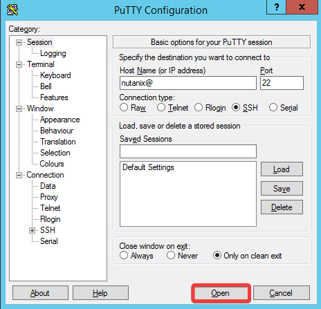

    !!!tip

          If you can't log in via SSH, within Prism Central, navigate to **:fontawesome-solid-bars: > Settings > Cluster Lockdown**. Ensure that **Enable Remote Login with Password** is checked.
          
      
6. Execute the following commands. These can be entered separately, or all at once.

    ```bash
    ncli
    ```

    ```bash
    rsyslog-config list-servers
    ```

    ```bash
    rsyslog-config list-modules server-name=ClusterLog
    ```

    If you receive this output, proceed to the **Once Per Table** note below.
    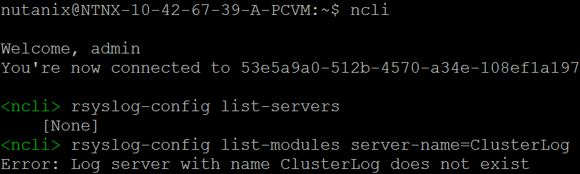

    If you receive this output, proceed to [Configure Syslog on Prism Element](#configure-syslog-on-prism-element).
    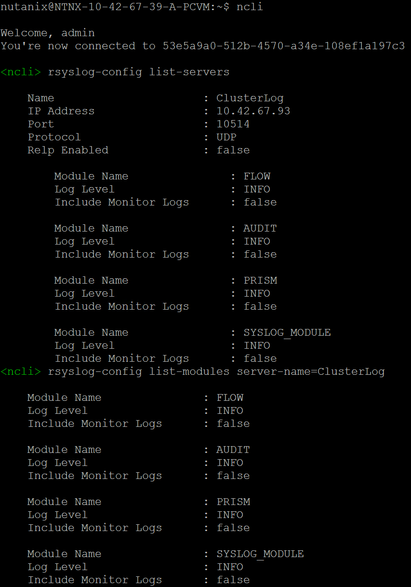

    !!!warning "Once Per Table"
    
              Only one person per table needs to run the following steps. If you're missing the ClusterLog server or FLOW, AUDIT, PRISM, and SYSLOG_MODULE in the list, enter the following.

              Be sure to replace **GRAYLOG-IP-ADDRESS** with your Graylog IP address, before pressing **Enter**.

              ```bash
              ncli
              ```
          
              ```bash
              rsyslog-config add-server name=ClusterLog ip-address=GRAYLOG-IP-ADDRESS port=10514 network-protocol=udp relp-enabled=false
              ```
          
              ```bash
              rsyslog-config add-module server-name=ClusterLog module-name=FLOW level=INFO include-monitor-logs=false
              ```
          
              ```bash
              rsyslog-config add-module server-name=ClusterLog module-name=AUDIT level=INFO include-monitor-logs=false
              ```
              
              ```bash
              rsyslog-config add-module server-name=ClusterLog module-name=PRISM level=INFO include-monitor-logs=false
              ```
              
              ```bash
              rsyslog-config add-module server-name=ClusterLog module-name=SYSLOG_MODULE level=info include-monitor-logs=false
              ```
              
              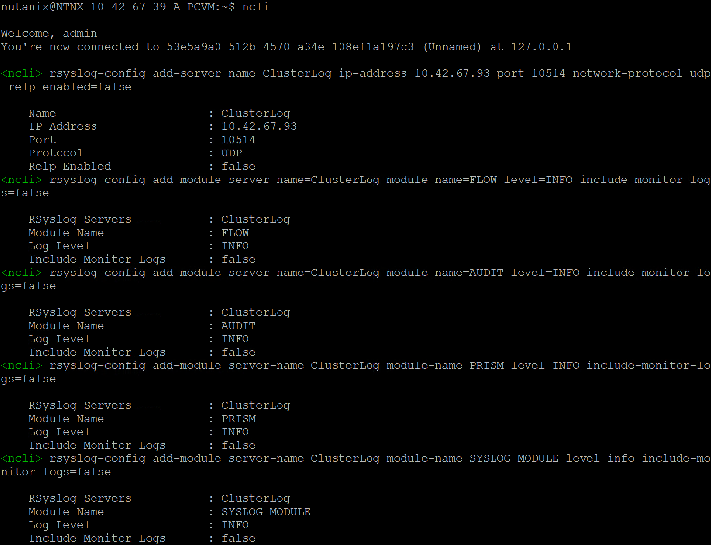

7. Exit your SSH session.

### Configure Syslog on Prism Element

!!!warning 
          Making syslog module changes in the Prism Element web interface may erase the Command Line Interface ([CLI](https://en.wikipedia.org/wiki/Command-line_interface)) changes you are about to make. Do not use the Prism Element web interface to set syslog modules in this lab.
          

1. From within the **Tools** folder on the desktop, open PuTTY.

2. Within the **Specify the destination you want to connect to** section, enter `nutanix@PRISM-ELEMENT-IP-ADDRESS` in the **Host Name (or IP address)** field. Click **Open**. When prompted for a password enter `gts23TechX!`.

    

3. Execute the following commands to verify that the syslog server is present within Prism Element. These can be entered separately, or all at once.

    ```bash
    ncli
    ```

    ```bash
    rsyslog-config list-servers
    ```

    ```bash
    rsyslog-config list-modules server-name=ClusterLog
    ```

    If you receive this output, proceed to the **Once Per Table** note below.
    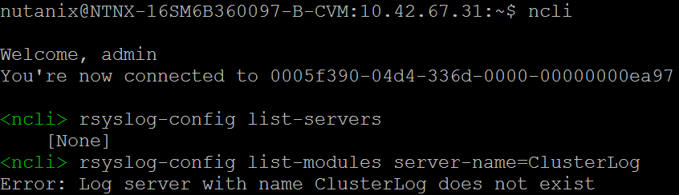

    If you receive this output, proceed to [Syslog Verification](./chapter1.md/#syslog-verification).
    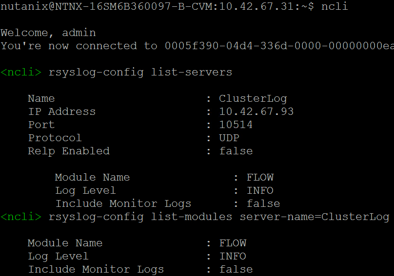


    !!!warning "Once Per Table"
  
              If the ClusterLog server or FLOW module is missing, enter these commands to set up Security Policy Hit Logs on the Prism Element cluster. These can be entered separately, or all at once.
          
              Be sure to replace **GRAYLOG-IP-ADDRESS** with your Graylog IP address, before pressing **Enter**.
  
              ```bash
              rsyslog-config add-server name=ClusterLog ip-address=GRAYLOG-IP-ADDRESS port=10514 network-protocol=udp relp-enabled=false
              ```
          
              ```bash
              rsyslog-config add-module server-name=ClusterLog module-name=FLOW level=INFO include-monitor-logs=false
              ```
  
              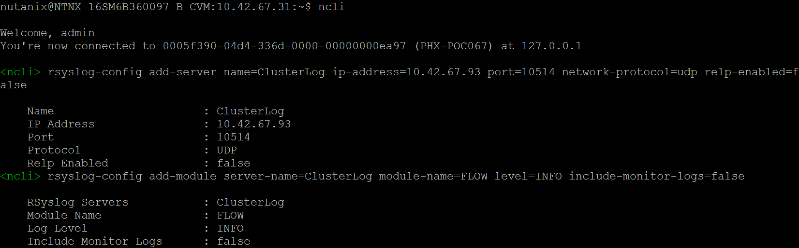

1.  You may close your SSH session. However, leave the Remote Desktop session active.

### Syslog Verification

First, we'll generate some events that will cause logs to be sent to our syslog server.

1. Within Prism Central, navigate to **:fontawesome-solid-bars: > Compute & Storage > VMs**.

2. Select **User##-WinTools** by checking the adjacent box.

3. Click **Actions > Manage Categories**. You may need to scroll down to see this entry.

   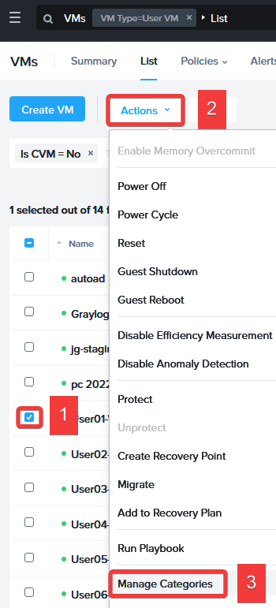

4. In the **Search** field type `Tenant: User##`, select the **Tenant: User##** category, and click **Save**.

    These changes won't affect the VM since there are no policies in effect yet. However, you will see the changes we made to the VM's category created an auditable event. Let's find it!

5. Open your browser, enter `http://GRAYLOG-IP-ADDRESS:9000`, and press the **Enter** key. Log in with the following credentials:
   - **Username** - `admin`
   - **Password** - `nutanix default`

6. Click **Streams > All Messages**.

   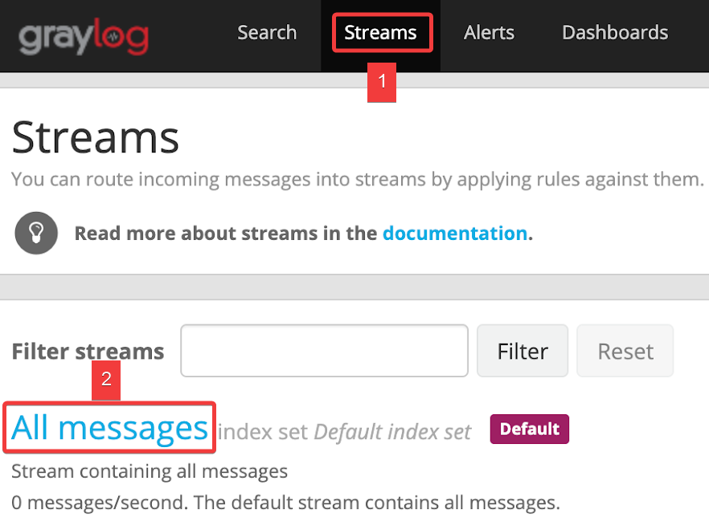

7. Within the time range drop-down, select **Search in the last 30 minutes**. Enter the search term `consolidated_audit` and press the **Enter** key. The audit logs will show which VM was changed and who made the change. You will also see their differences if there are other users on this cluster.
  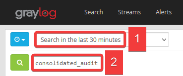

8. Perform the following within your Remote Desktop session. This time you are going to enter the incorrect password intentionally.

    - Open PuTTY. Within the **Specify the destination you want to connect to** section, enter `hacker@PRISM-CENTRAL-IP-ADDRESS` in the **Host Name (or IP address)** field. Click **Open**. When prompted for a password enter `12345`.
      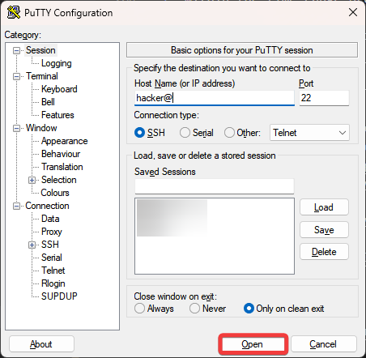
    - Once complete, you may close your PuTTy session.

9. Repeat the search in Graylog, this time entering `"Failed password"` (including the quotes) within the search field.

    

10. Within the **Messages** section, you will see an entry with **NTNX-PC-IP-ADDRESS-A-PCVM** similar to the below.

    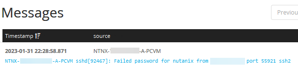

## Role-Based Access Control (RBAC)

RBAC is critical in multiple tenets and pillars of the [Zero Trust Architecture (ZTA)](https://en.wikipedia.org/wiki/Zero_trust_security_model). What if one key could open every door? Everyone who possessed a copy of this key could open any locked door regardless of their need or requirement to access what is behind it. This discretionary access is analogous to responding to all access requests by assigning full administrator privileges, regardless of their functional administrative responsibility. This method of assigning access is a significant security risk. An administrator can accidentally change or remove something they had no business accessing, causing disruption and potential downtime.

Today, we can assign cluster administrators to one or more roles that restrict access to only what is needed for their specific job responsibilities. We can use system-defined roles or even create new roles to determine which elements a user can access and the type of access for each of those elements.

In this lab, we will assign a user to a system-defined role. This user will have a role that aligns with their job responsibilities. We will use entity filters when assigning a user to a role to restrict further the user's access to the elements necessary to perform their duties.

We'll start with the highest privilege user, **adminuser##**, who can manage these roles and assign them to others.

1. Navigate to **:fontawesome-solid-bars: > Administration > Roles**.

2. Click directly on the **Operator** role.

3. Select Manage Assignment from the top menu bar.
  
   

4. Click **Add New**.

    - Within the **Select Users or User Groups or OUs** section, enter `operator##` into the **Search User** field, and select the entry. We will assign this user fewer permissions than **adminuser##**.

    - Within the **Select Entities** section, select **AHV VM** from the **Entity type** drop-down.

    - Select **In Cluster** from the **Condition** drop-down.

    - Enter `POC` within the **Search Cluster** field, and select your cluster (ex. PHX-POC088.)

    - Click **Save**.

      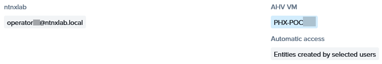

5. Click the :fa-x: in the top-right corner.

6. Select **Sign Out** from the username drop-down (in this case **Adminuser##**) located in the upper right corner.

7. Log into Prism Central.
    - **username** - `operator##@ntnxlab.local`
    - **password** - `nutanix default`

8. Navigate to **:fontawesome-solid-bars: > Data Protection**.

    Which actions can this user perform? This user's access has been restricted, and we can add more permissions through the roles and assignments if needed.

    <details>
      <summary>Open After Performing The Above</summary>
      
      This screenshot illustrates what you should see.

      
      
    </details>

9. Select **Sign Out** from the username drop-down (in this case **Operator##**) located in the upper right corner.

## UI Timeouts

Have you ever walked by an empty workstation and noticed it was unlocked? Timeouts ensure that sessions close when they are no longer in use, preventing unauthorized access and reducing the exposure to potential unauthorized access and data breaches. While it is common for organizations to enforce such timeouts for workstations and laptops, ensuring this is done for administrative connections to a cluster is essential to protect your environment.

!!!info
       The below steps are for illustration purposes only. There are no changes for you to make.


1. Log into Prism Central.
    - **username** - `adminuser##@ntnxlab.local`
    - **password** - `nutanix default`

2. Navigate to **:fontawesome-solid-bars: > Prism Central Settings**. You may need to scroll down to see this entry.

3. Select **UI Settings** from within the **Appearance** section. You may need to scroll down to see this entry.

   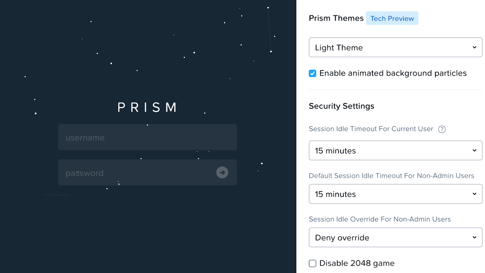

It is recommended to select the minimum timeout values and deny override.

## Cluster Lockdown and SSH Keys

Did you know you can enable SSH passwordless login to your Nutanix clusters?

 - Ensures passwords do not need to be sent over the network
 - Resistant to brute force attacks
 - Decreases the risk of exposed login credentials

  |User|Public Key|Private Key|User|Public Key|Private Key|
  |:--:|  :--:    |   :--:    |:--:|   :--:   |   :--:    |
  | **User01** | <a href="/ts23labs/secure/User01Public.txt" target="_blank">User01 <br /> Public Key</a> | [User01 Private Key](http://10.42.194.11/hol/ts23labs/secure/User01Private.ppk) | **User06** | <a href="/ts23labs/secure/User06Public.txt" target="_blank">User06 <br /> Public Key</a> | [User06 Private Key](http://10.42.194.11/hol/ts23labs/secure/User06Private.ppk) |
  | **User02** | <a href="/ts23labs/secure/User02Public.txt" target="_blank">User02 <br /> Public Key</a> | [User02 Private Key](http://10.42.194.11/hol/ts23labs/secure/User02Private.ppk) | **User07** | <a href="/ts23labs/secure/User07Public.txt" target="_blank">User07 <br /> Public Key</a> | [User07 Private Key](http://10.42.194.11/hol/ts23labs/secure/User07Private.ppk) |
  | **User03** | <a href="/ts23labs/secure/User03Public.txt" target="_blank">User03 <br /> Public Key</a> | [User03 Private Key](http://10.42.194.11/hol/ts23labs/secure/User03Private.ppk) | **User08** | <a href="/ts23labs/secure/User08Public.txt" target="_blank">User08 <br /> Public Key</a> | [User08 Private Key](http://10.42.194.11/hol/ts23labs/secure/User08Private.ppk) |
  | **User04** | <a href="/ts23labs/secure/User04Public.txt" target="_blank">User04 <br /> Public Key</a> | [User04 Private Key](http://10.42.194.11/hol/ts23labs/secure/User04Private.ppk) | **User09** | <a href="/ts23labs/secure/User09Public.txt" target="_blank">User09 <br /> Public Key</a> | [User09 Private Key](http://10.42.194.11/hol/ts23labs/secure/User09Private.ppk) |
  | **User05** | <a href="/ts23labs/secure/User05Public.txt" target="_blank">User05 <br /> Public Key</a> | [User05 Private Key](http://10.42.194.11/hol/ts23labs/secure/User05Private.ppk) | **User10** | <a href="/ts23labs/secure/User10Public.txt" target="_blank">User10 <br /> Public Key</a> | [User10 Private Key](http://10.42.194.11/hol/ts23labs/secure/User10Private.ppk) |

Both keys are provided for this lab to eliminate the typical process for creating keys, considering the limited time allotted for the lab.

!!!tip

      - Your public key is named **User##Public.txt** and your private key is named **User##Private.ppk**.
      - Clicking **User## Public Key** will open a new tab, displaying the contents of the file.
      - Clicking **User## Private Key** will download the file.


1. Return to your Remote Desktop session. Log into Prism Central.
    - **username** - `adminuser##@ntnxlab.local`
    - **password** - `nutanix default`

2. Navigate to **:fontawesome-solid-bars: > Prism Central Settings**. From the **Security** section, select **Cluster Lockdown**. You may need to scroll down to see this entry.

3. Click on your **User## Public Key** from the table above. Copy the entire text.

4. Click **:fa-plus: New Public Key**. Fill out the following fields, and click **Save**.

    - **Name** - `User##`
    - **Key** - Paste your public key into they **Key** field
      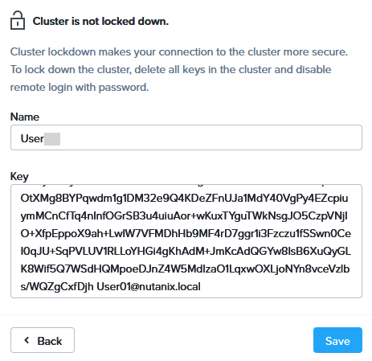

5. Click [**Cluster Lockdown and SSH Keys**](./chapter1.md/#cluster-lockdown-and-ssh-keys). Right-click on your **User##Private.ppk** entry in the table, and choose **Copy Link**.

6. Within your Remote Desktop session, open a new browser tab, paste the link, and press **Enter**.

7. Right-click on a blank section of the main browser window, and choose **Save As...**. Choose the **Downloads**, and click **Save**.

8. Open PuTTy.

9. Within the **Connection** section in the left pane, expand **SSH**, and click **Auth**.

10. Within the **Authentication parameters** click **Browse**. Click on the **Downloads**folder. Select your private SSH Key **User##Private.ppk**, and click **Open**.

    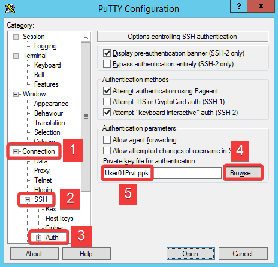

11. Click on **Session**. Within the **Specify the destination you want to connect to** section, enter `nutanix@PRISM-CENTRAL-IP-ADDRESS` in the **Host Name (or IP address)** field.

12. Within the **Load, save or delete a stored session** section, enter `Prism Central` within the **Saved Sessions** field, and click **Save**.

    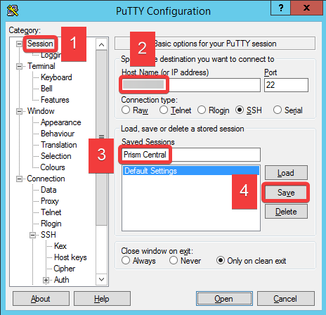

    Now that your Public Key has been uploaded to Prism Central, and you've configured PuTTY, let's test SSH passwordless login.

13. Ensure the **Prism Central** entry is highlighted, and click **Open**. You will be connected to Prism Central without being prompted for a password.

    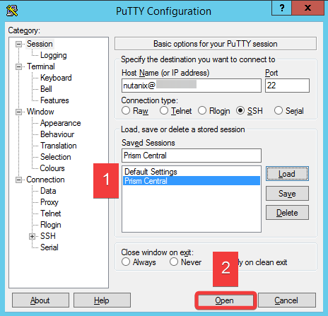

## Nutanix Vulnerability Database

As part of your mandate from the CIO, you've been tasked with finding a resolution to [CVE-2021-4034](https://nvd.nist.gov/vuln/detail/cve-2021-4034). Nutanix Vulnerability Database (NXVD) on the Nutanix Support Portal is an excellent resource for finding more information about this CVE. For this lab, we'll show you the process for reference, so you can be familiar with it when you perform these steps yourself.

[Nutanix Vulnerability Database demo](https://nutanix.storylane.io/share/0v7ck0s2oy20).

The solution to this vulnerability is an update we can implement via LCM (Life-Cycle Manager.)

Follow this [LCM demo](https://nutanix.storylane.io/share/qrgkjmds1dqx) to see how easy that process can be.

## Security Dashboard

What if there was a way to manage platform security features in one place, giving you visibility and ease of configuration? The Prism Security Dashboard does just that in Prism Central 2022.9 and AOS 6.6, which we recently released.

[Follow this Prism Security Dashboard demo](https://nutanix.storylane.io/share/ieoopgj2kk7i) to see the new Prism Security Dashboard in action.

## Default Passwords

!!!warning
          These steps are provided as informational only. Do not execute these steps in this lab. Additionally, [KB-6513](https://portal.nutanix.com/kb/000006153) can be used to guide you through the process in your production environment.

Nutanix released [Security_advisory_0011](https://download.nutanix.com/alerts/Security_Advisory_0011.pdf) and a corresponding NCC health check which will generate a critical alert for default passwords. It is highly recommended to change the default passwords of the CVMs, Prism Central, AHV hosts, and other components during the initial installation process.

## SSL Certificates

As part of this lab, let's go through a quick [SSL Certificate Replacement demo](https://nutanix.storylane.io/share/ilnmremodp07) based on Prism Central. In this demo, we use a self-signed certificate. However, your production environment would obtain a certificate from a Certificate Authority (CA). In production, you would also repeat these steps on every connected Prism Element cluster.
