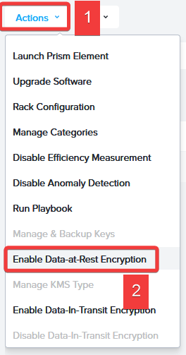
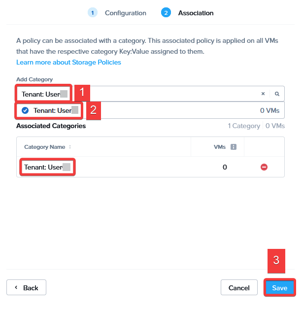
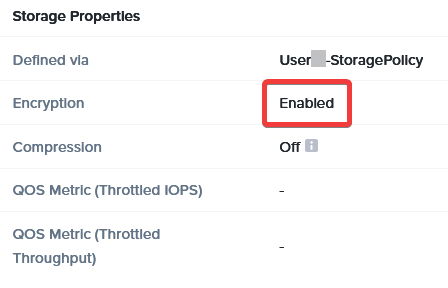

# Chapter 2: Data Security

## Primary Storage Data Protection

### Encryption

Data-at-Rest Encryption (DARE) encrypts :closed_lock_with_key: data when it is stored on disk (i.e., not while active within a system's memory).

DARE is an essential element within a security strategy because it prevents data from being recovered from a decommissioned cluster. To anyone without the keys, the data is scrambled. 

Nutanix DARE can be deployed using an external key manager or our built-in native key manager. Encryption can be applied in hardware with Self-Encrypting Drives (SED) or in software with non-SED drives. You can even encrypt the entire cluster, storage containers, or per-VM using Storage Policies. 

The lab cluster is already licensed for encryption. We will use per-VM, or entity and policy-based encryption to support multi-tenancy in this shared lab environment. Most customers will just use cluster-based encryption which requires less configuration.

!!!warning "Once Per Table"
          Only one user per table needs to perform this step.:::

1. Navigate to Prism Central and Select :fontawesome-solid-bars: > Hardware > Clusters.

2. Select your cluster by clicking the check box.

:::tip Already Encrypted?
If your cluster is already encrypted, click Actions > Manage & Backup Keys, and proceed to step 7.
:::

3. Click Actions > Enable Data-at-Rest Encryption. 

   

4. Select Entity Encryption, and click Save Encryption Type.

5. Ensure Native KMS (Local) is selected, and click Enable Encryption.

6. Type `SET` in the confirmation window, and click Set Encryption.

7. Before encrypting any VMs, it is recommended to back up the encryption keys somewhere safe.

8. Click Backup Keys.

9. Enter `nutanix default` within both the **Password** and **Confirm Password** fields. Click Backup Key. A download will begin for a .zip file containing your backup key, which allows you to recover the encryption key. Click Close.

#### Encrypting With Storage Policies

Next, we'll configure **Storage Policies** that can apply to specific sets of VMs or even individual VMs based on category.

1. Navigate to :fontawesome-solid-bars: > Compute & Storage > Storage Policies.

2. Click :fa-plus: Create Storage Policy. Fill out the following fields.
 
    - **Name** - `User##-StoragePolicy`
    - Within the **Encryption** section, choose Enabled from the **Value** drop-down.

3. Click Next.

4. Type `Tenant: User##` within the **Add Category** field. Select the Tenant: User## entry from the list, and click Save.
 
   

    Now all VMs assigned the category **Tenant: User##** will be encrypted as this policy is enforced. Let's test this out with **User##-WinTools**, which we had assigned the **Tenant: User##** category in Chapter 1.

5. Navigate to :fontawesome-solid-bars: > Compute & Storage > VMs.

6. Right-click on User##-WinTools, and choose Clone.

7. Enter `User##-WinTools-Clone` within the **Name** field, and click Next > Next > Next > Clone VM.

8. Once the clone has been created, click directly on User##-WinTools-Clone.

9. Refer to the **Storage Properties** pane. Is your VM encrypted?

    
    
    This method allows you to choose which individual VMs are encrypted without encrypting the entire cluster.

10. Choose Power On from the **More** drop-down.

### Snapshots

Snapshots create a local point-in-time recovery option that can act as a first-line defense for ransomware or data loss protection. They can also be handy for incident response and other investigations. We'll create snapshots that can act as an "undo" if you need to restore from a minor incident. 

1. Navigate to :fontawesome-solid-bars: > Data Protection > Protection Policies.

2. Click Create Protection Policy. Fill out the following fields.
    - **Policy Name** - ``User##-LocalProtectionPolicy``
    - Select your cluster from the **Cluster** drop-down, and click Save.

3. Within the **Primary Location** section, click :fa-plus: Add Local Schedule > Save Schedule.

4. Within the **Recovery Location** section, click Cancel, as we aren't replicating to a remote location within this lab.

5. Click Next.

6. Within the **Categories** section, check the box adjacent to **Tenant: User##**, and click Add.

7. Click Create.

    Every VM within your **Tenant: User##** category will be protected by the local protection policy you just created.

8. We will verify that these snapshots are being created as expected. Navigate to :fontawesome-solid-bars: > Compute & Storage > VMs.

9. Click directly on User##-WinTools.

10. Click Recovery Points from the top menu bar to view the recent snapshots. Note: It can take a few minutes for these to show up in the UI. Take advantage of this time to stand up and stretch. You probably need it at this point! :smile:

11. Check the box adjacent to **User##-WinTools**, and click Actions > Clone to create a new VM from snapshot. For brevity, you created a **Crash Consistent** snapshot, which does not restore the memory state of the VM. However, this enables you to restore to a point before a known incident.

12. Leave the **New VM Name** as default, and click Clone.

    Snapshots are a vital part of your security plan. However, since they are typically stored on the same cluster as the original VMs, you should always rely on protecting your workloads outside of snapshots. If the cluster is compromised or unavailable, so are the snapshots. We need a method that makes a copy of our data off-cluster.

### Backups

Backups play a vital role in security. Keeping a secured set of offline backups that exist separately from the primary storage gives you more robust recovery options in the event of a security incident. These methods may even be required to meet the standards of particular industries.

Nutanix works with a wide range of backup partners. While we did not include backup exercises in this lab, we suggest you [Take a Backup Test Drive](https://www.nutanix.com/one-platform?type=minehycu) demonstrating Nutanix Mine in the future.

## Unified Storage (Data Services)

Now that you've secured your infrastructure platform let's show how Nutanix Data Lens and Nutanix Objects can protect your unstructured data. As these services are part of the Nutanix Cloud Platform, they benefit from the security features we've seen here: Data-At-Rest Encryption, snapshots, and backups.

### Nutanix Data Lens

In our example scenario, the customer development team utilizes a shared file server for their applications. They've chosen Nutanix Files and are wondering what sort of ransomware protections might be built to prevent a compromised development machine from disrupting their environment.

Let's consider a scenario where you detect ransomware in your file share, which is a potential blocker for an upcoming product launch. 

Nutanix Data Lens :mag: can help. View the [Nutanix Data Lens Demo](https://nutanix.storylane.io/share/zbdlcw50aeco) to see how we detect ransomware and block malicious access.

### Nutanix Objects

Nutanix Objects has supported AWS S3-compliant WORM (Write Once Read Many) for some time. With Objects 2.0, customers may now use WORM with non-versioned buckets.

Follow along in this [Nutanix Objects WORM Demo](https://nutanix.storylane.io/share/wnofmrpobqq8) to see how easy it is to create, secure, and selectively share buckets with our users. 