# Chapter 3: Network and Application Security

So far, you've learned how to secure the platform and data. Now we need to secure our applications and networking. Traditionally, applications have been secured at a layer 2 (VLAN) boundary, where data is filtered at the ingress/egress of the VLAN. However, layer 2 filtering allows all traffic between hosts within the same VLAN. When new applications are spun up, they are assigned to a VLAN, ingress/egress rules are updated, and the application is "on the wire."

What happens if one of these hosts in the VLAN is compromised? It means that all the VMs on the same VLAN are exposed and at an elevated risk for compromise. There is nothing natively restricting traffic within this VLAN. The solution is to deploy applications with security in place from day one, update existing applications with more granular security policies, then monitor your environment. In this section, we will use NCM Self-Service to deploy our applications securely using projects and multi-tenancy. We will then use Security Central to discover our newly deployed application's data flows. Finally, we'll use Flow Network Security and microsegmentation to secure our application inside the VLAN.

## Multi-tenancy: Projects and RBAC

Customers are always searching for ways to increase security by limiting what users can access. In the past, multi-tenancy was relevant to service providers and a few enterprise customers. Now customers of all shapes and sizes are looking at multi-tenancy to add a layer of security. Multi-tenancy helps protect business units from one another and specific projects from leaking into other areas. You may safeguard applications from one another when adding layers of roles and responsibilities that multi-tenancy provides.

This section will show how deploying Projects with NCM Self-Service can help customers implement multi-tenancy. Customers can deploy tenant-managed applications with security in place from launch. 

This pre-created Blueprint has security best practices and categories set by default. Hence, all you have to do is publish it for the tenant. Then the tenant clicks **Launch**.

To save you lab time, we've created the Projects and Blueprints.

1. Navigate to <mark>:fontawesome-solid-bars: > Services > Calm > Projects</mark>. 

2. Click the Project <mark>Tenant##</mark>.

3. Click <mark>Users & Groups</mark> within the top menu.

    Note: we've added consumer## to this project already.

4. Click <mark>Add/Edit Users and Groups</mark>.

    What role does the consumer## user have? You worked with these RBAC roles earlier in the lab.

5. Close this window by clicking the <mark>:fa-x:</mark>.

6. Navigate to <mark>:fontawesome-solid-bars: > Services > Calm > Blueprints</mark>. 

7. Check directly on **User##-DeployFiestaApp**.

8. Click <mark>Publish</mark>.

9. Select <mark>Publish with secrets</mark>, and enter `1.0.0` within the **Initial Version** field. Click <mark>Submit for Approval</mark>.

   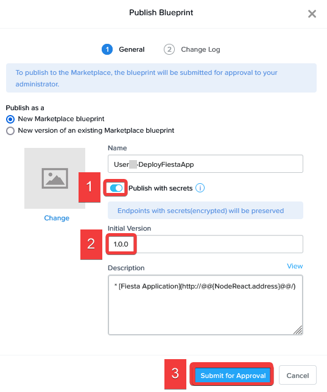

10. Navigate to the **Marketplace Manager**. 

11. Click <mark>Approval Pending</mark> from the top menu.

12. Select the check box adjacent to **User##-DeployFiestaApp**.

13. Within the **Projects Shared With** drop-down, select your <mark>Tenant##</mark> Project.

14. Within the **Category** dropdown, select <mark>DevOps</mark>.

1. Click the <mark>Approve</mark> check mark.

15. Click <mark>Approved</mark> from the top menu.

16. Search for and select your **User##-DeployFiestaApp** by typing `User##` within the **Type here to apply filters** field, and pressing **Enter**. Select the check box adjacent to **User##-DeployFiestaApp**.

17. Click <mark>Publish</mark>.

18. Select <mark>Sign Out</mark> from the username drop-down (in this case <mark>Adminuser##</mark>) located in the upper right corner.

## Repeatable Security: NCM Self-Service

You'll now connect to Prism Central as a limited privilege tenant consumer user who can launch applications but can't change security settings. When this consumer user launches a blueprint, all categories and policies are pre-configured. Your application will be secure by default right as it's deployed. This example launches a simple app that has a web and database component.

1. Log into Prism Central.
    - **username** - `consumer##@ntnxlab.local`
    - **password** - `nutanix/4u`

2. Navigate to <mark>:fontawesome-solid-bars: > Calm > Marketplace</mark>. 

3. Within the **Search marketplace** field enter `user##`, and click <mark>Get</mark>.

    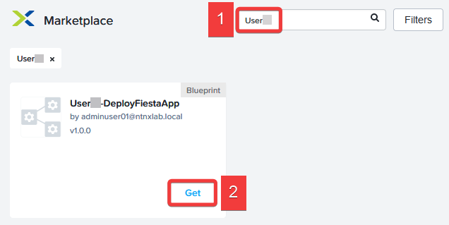

4. Click <mark>Launch</mark>. Fill out the following fields, and click <mark>Deploy</mark>.

    - **Application Name** `User##-FiestaApp`
    - **Initials** - `User##`
    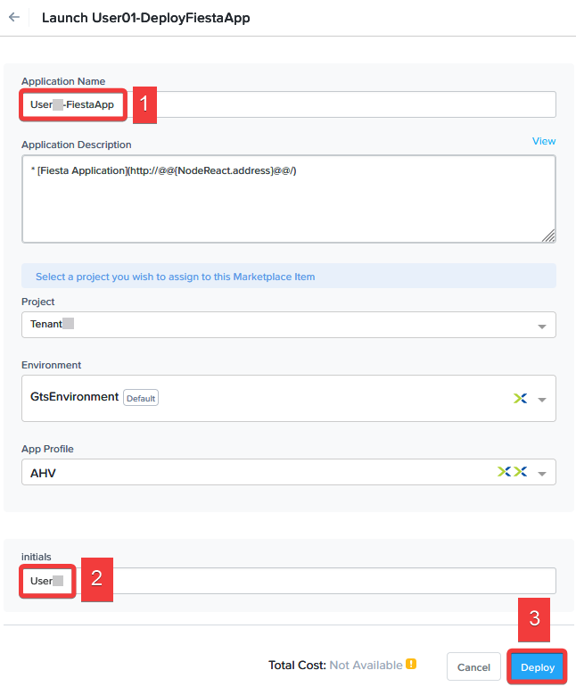

      Your application will take a few minutes to deploy. Let's use this time to demonstrate Security Central, which will discover the application's communication flows and provide suggestions on how best to secure the application.

## Security Planning With Security Central

Getting the right microsegmentation policy for your infrastructure takes time, especially if you have many VMs. You may need to involve multiple teams to identify ports, IPs, security approvals, and application owners.

Nutanix Security Central simplifies microsegmentation policy creation with **Security Planning** by collecting Internet Protocol Flow Information Export ([IPFIX](https://en.wikipedia.org/wiki/IP_Flow_Information_Export) records. Based on this collected data, Security Planning learns which VMs communicate and recommends groups and policies with machine-learning algorithms. 

Follow along in this [Security Central Security Planning demo](https://nutanix.storylane.io/share/7lei9le9rzed) to see how we can easily visualize and securely the newly created Fiesta application.

## Microsegmentation with Flow Network Security

We have shown how **Security Central** can help you examine your applications and plan our security policies. Now, let's check on the status of our application deployment.

1. Navigate to <mark>:fontawesome-solid-bars: > Compute & Storage > VMs</mark>. You will see the VMs created and used by your FiestaApp. Notice you only see VMs associated with your Project. You will not see any VMs created by other projects or users since **consumer##@ntnxlab.local** has limited permissions.

    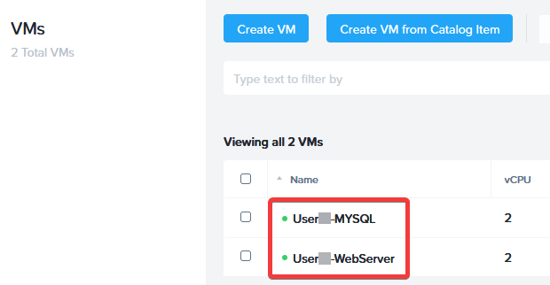

2. Note the IP address of **User##-WebServer**.

3. Open a new browser tab, type `http://FIESTA-WEBSERVER-IP`, and press <mark>Enter</mark>. Spend a few moments to purchase party supplies to create web and database traffic.

4. Within your Remote Desktop, open **Command Prompt** by clicking <mark>Start</mark>, typing `command prompt`, and pressing enter.

5. Type `ping -t FIESTA-WEBSERVER-IP-ADDRESS` and press **Enter** to start a continuous ping from your **User##-WinTools** VM to the IP address of your Fiesta web server.

    Now let's secure the Fiesta App using Flow Network Security.

6. Within Prism Central, select <mark>Sign Out</mark> from the username drop-down (in this case <mark>Consumer##</mark>) located in the upper right corner. Log into Prism Central.

7. Log into Prism Central.
    - **username** - `adminuser##@ntnxlab.local`
    - **password** - `nutanix/4u`

8. Navigate to <mark>:fontawesome-solid-bars: > Network & Security > Security Policies</mark>.

9. Click the Security Policy **User##-FiestaApp**. This is the policy associated with your Fiesta App deployment.

    There are two operational states for a security policy: Monitor and Enforce. Your policy is currently in Monitor Mode.

  - **Monitor** monitors the policy without restricting traffic flows. All traffic flowing through the policy is still logged to the configured Syslog server even though no action is being taken to limit the data flow.
  - **Enforce** restricts communications based on the configured policy.

10. Within the security policy, the solid blue connections are the traffic permitted by the policy. You can hover over these lines to view what is being allowed.

    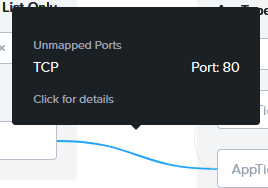
    
    Traffic displayed in yellow would automatically be blocked if the policy changed from Monitor to Enforce.

11. Hover over the discovered traffic sourced from your **User##-WinTools** VM pings. You will see the ICMP traffic you are generating from your WinTools VM.

    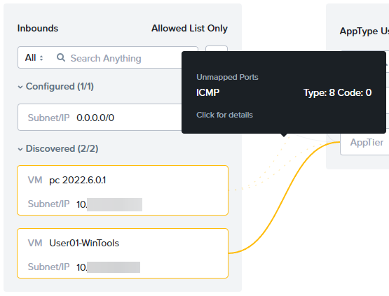

    Let's change the policy mode to Enforce. 

12. Click <mark>Enforce</mark> from the upper right menu. 

13. Type **ENFORCE** into the confirmation window.

    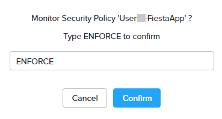

    This secondary confirmation helps customers avoid activating a misconfigured security policy, which could result in application interruptions or a weakened security state.

14. Close your security policy by clicking :fa-x: in the top right corner. Open your policy by selecting your <mark>User##-FiestaApp</mark> security policy.

    The traffic previously shown in yellow while the policy was in monitor mode is now blocked and shown in red.

    Your Fiesta app will still be accessible in the web browser while the ping is blocked.

    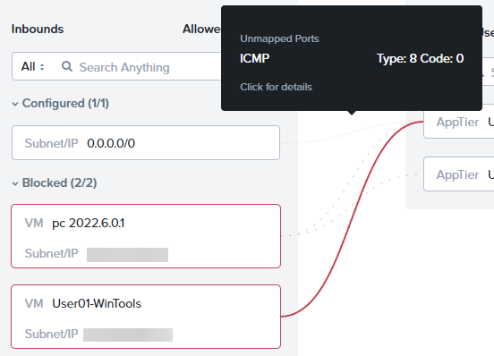

15. Return to your Remote Desktop session, and observe that your ping command is no longer receiving a response.

    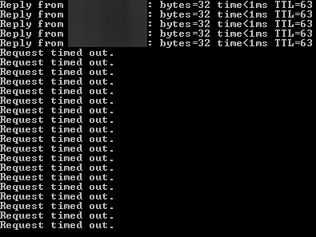

### Security Policy Logging

Let's go back to our syslog server and see what it detected. While our policy dropped the traffic, we need more than this to satisfy our security auditing team.

1. Open your browser, enter `http://GRAYLOG-IP-ADDRESS:9000`, and press the **Enter** key. Log in with the following credentials:
   - **Username** - `admin`
   - **Password** - `nutanix/4u`
2. Click <mark>Streams > All Messages</mark>.

3. Within the time range drop-down, select <mark>Search in the last 30 minutes</mark>. Enter the search term `hitcount*` and press the <mark>Enter</mark> key.

    Find the log entries associated with your application and policy and note the **ACTION** field in the message.

    You will see flowing traffic and allowed tagged as **ACTION=ALLOW**.

    You will also see the ICMP traffic from your **User##-WinTools** VM being blocked with **ACTION=DROP**.

   

    We will now amend this policy to allow ICMP between **User##-WinTools** to your **User##-WebServer**.

5. Return to Prism Central, and click <mark>Update</mark>. To allow the discovered flows in the Security Policy,

6. Click <mark>Next > Ok, got it!</mark>.

7. Hover over the **User##-WinTools** entry within the **Inbounds > Blocked** section.

8. Click <mark>Allow Traffic</mark>.

    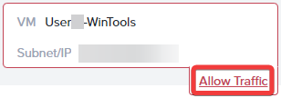

9. Check the box adjacent to **User##-WinTools** within the **Source** column, and click <mark>Allow 1 Discovered Traffic</mark> in the lower right corner. 

    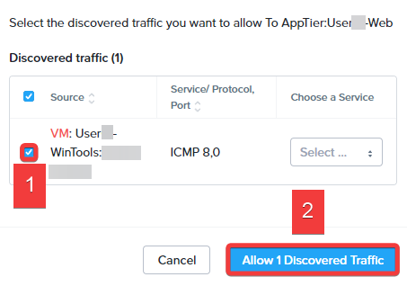

10. Click <mark>Next > Save and Enforce</mark>.

11. Click the Security Policy **User##-FiestaApp**. You will now see the previously-blocked ICMP traffic flowing between **User##-WinTools** to your **User##-WebServer**.

    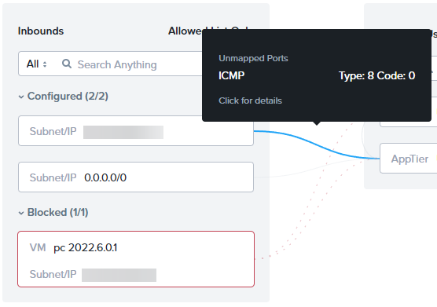

12. Return to your Remote Desktop session. Observe that your ping is no longer blocked.

    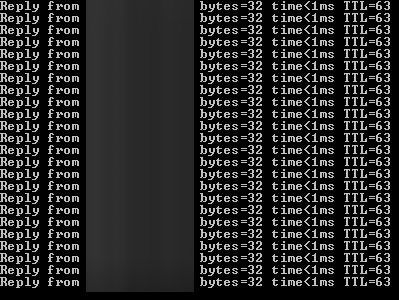

## Conclusion

- You've seen how security exists at all layers of the Nutanix Cloud Platform, from infrastructure to applications. Now you're ready to show the CISO how to protect their infrastructure and remediate vulnerabilities.

- To learn more about security, sign up for the **Nutanix Platform Security in Depth** session, where we'll cover these features and more.

- We invite you to share these lab exercises and demos after you return home.

- Please take the time to fill out the Slido survey. You can scan the QR code on your table sheet to open the URL, or use the Tech Summit app. Thank you so much!
