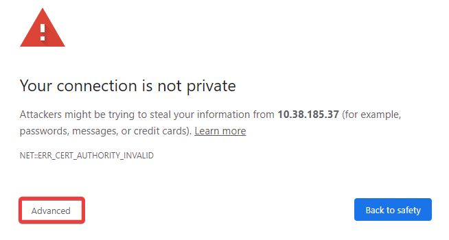

# Environment Details
Nutanix Bootcamps are intended to be run within the Nutanix Hosted POC (HPOC) environment. Your cluster contains all the necessary images, networks, and VMs to complete the exercises.

!!!danger

         Do not perform any upgrades to the environment. This includes, but is not limited to, Prism Element (PE), Prism Central (PC), Acropolis Operating System (AOS), Nutanix Cluster Check (NCC), Foundation, any hardware-specific updates (ex. firmware), and any software within any remote sessions (ex. Graylog, Linux packages, PuTTY, Sublime Text).
         
         Doing so will negatively impact your lab experience and potentially any other attendees using this cluster.

## Initial Connection And Configuration

### Nutanix Employees

- Choose VPN (Global Protect) or VDI (Frame, Parallels) unless otherwise specified.
- Log in using the credentials listed in the **X-Labs VDI/VPN Connection Information** section.

### Non-Nutanix Employees

- Choose VPN (Ivanti) or VDI (Frame, Parallels) unless otherwise specified.
- Log in using the credentials listed in the **X-Labs VDI/VPN Connection Information** section.

### VDI

#### VDI Connection Options

**Parallels**

1. Log in [here](https://phx-ras.xlabs.nutanix.com).

2. Click on the Profile icon, and choose Download Client.

3. Click the Download button for your operating system.

4. Run the Parallels installation.

5. Click Install Basic Client.

6. Launch **Parallels Client**.

7. Accept the EULA.

8. When prompted with **You have no RAS Connection configured, would you like to add one now?**, click Yes.

9. Enter `phx-ras.xlabs.nutanix.com` in the field, and click Next > Next.

10. Fill out the **Username:** and **Password:** fields, and click Connect.

11. Right-click on the **X-Labs - PHX** entry, and click Connect.

**Frame**
1. Log in [here](https://console.nutanix.com/x/labs).

2. Enter your **Username**, click Next, enter your **Password**, and click Next.

4. Click on Desktop.

#### VDI Monitor Configuration Recommendations

 - Additional monitor: Lab instructions.
 - Your laptop's monitor: VDI session. Your sessions will be initiated from here (ex., Remote Desktop, SSH).

!!!warning

          Always use applications within the remote session. Otherwise, the version you use may look or operate differently and could negatively impact your ability to complete the lab in the time allotted. Additionally, this aids with handling downloaded files, as all downloaded files would be within the remote session.

### VPN

#### VPN Connection Options

**Ivanti Connect Secure VPN Client**

1. If the client is already installed, skip to step 5.

2. To download the client, log in [here](https://phx-vpn.xlabs.nutanix.com).

3. Click Start > Download to begin downloading the client.

4. Click HERE to continue the installation.

5. Check the box Always allow **https://phx-vpn.xlabs.nutanix.com** to open **pulsesecure** links and click Yes > Yes > Yes. The client download and installation will now proceed.

6. Click Yes > Yes > Yes. The client will now open, and you are now connected.

#### VPN Monitor Configuration Recommendations

 - Additional monitor: Lab instructions.
 - Your laptop's monitor: Your Remote Desktop session will be initiated from here
 
!!!warning
          Always use applications within the remote session. Otherwise, the version you use may look or operate differently and could negatively impact your ability to complete the lab in the time allotted. Additionally, this aids with handling downloaded files, as all downloaded files would be within the remote session.

## Conventions Used In This Lab

1. *Italics* - Replace with a value from your environment (ex., replace PRISM-CENTRAL-IP-ADDRESS with the Prism Central IP address from your assigned cluster.)

2. `Code` - Text you must enter, whether copy and paste or manually input (ex. Type `thisisunsafe`.)

3. **Bold** - Used to differentiate adjacent text. (ex. **Name** - Saul Goodman.)

4. Highlight - A named entry you will click on (ex. Click Advanced.)

5. [Links]() - Added for additional contexts, such as an acronym (ex. [CISO](https://en.wikipedia.org/wiki/Chief_information_security_officer)) or software downloads (ex. [PuTTY](https://the.earth.li/~sgtatham/putty/latest/w64/putty-64bit-0.78-installer.msi))

6. :fa-caret-right: (caret right) - Text or image that is initially hidden but can be expanded by clicking directly on the :fa-caret-right:.

    

      
Ex. Click here to see a picture of my cat

      
      Aren't you glad you clicked? Isn't she just the sweetest?

      
      
    

## Know Before You Go

 - Unless otherwise specified, credentials are listed on the Tech Summit 2023 landing page.
 - Never use the information within screenshots in your environment. Screenshots are shown for illustration purposes only (ex., IP addresses.)
 - Ignore any IP addresses that resemble **169.254.###.###**.
 - Throughout the lab, you will see the usage of **##** (ex. **User##**). Replace the **##** with your assigned number on the Tech Summit 2023 landing page. For example:
    - Active Directory user - adminuser01@ntnxlab.local
    - Windows Tools VM: User01-WinTools
    - VDI/VPN: DM3-POC020-User04
 - The cluster's time zone is UTC (previously GMT).
  - Las Vegas, NV - PDT = UTC -8
  - Singapore - SGT = UTC +8
  - Paris, France - CET = UTC +1
 - If instructed to:
    - SSH (Secure Shell) - Use [PuTTY](https://the.earth.li/~sgtatham/putty/latest/w64/putty-64bit-0.78-installer.msi) within your Remote Desktop session
   - Remote Desktop, Remote Desktop Protocol (RDP), or Remote Desktop Connection (RDC)
    - Mac - [Microsoft Remote Desktop](https://apps.apple.com/nl/app/microsoft-remote-desktop/id1295203466?l=en&mt=12)
    - Windows - **Remote Desktop Connection** (built-in) on Windows using **Start Menu > Remote Desktop Connection**
 - It is highly recommended to use Chrome. Using other browsers may present unexpected results and consume your allotted time. If you are presented with a security warning in Chrome, use one of the following methods to proceed. 
   - Chrome (method 1)
     1. Click Advanced.
      
     2. Click on any blank section within the main browser window.
     3. Type `thisisunsafe`. Note: the text you type will not be visible.
      
   - Chrome (method 2)
     1. Click ^^Advanced^^
      
     2. Click Proceed to *IP-ADDRESS* (unsafe).
      

## A Request Before You Begin

We kindly ask for the following, as we want to ensure that everyone has the most impactful experience possible. Tech Summit only happens once a year, and for a great many folks it's one of the few times they have dedicated time with hands-on labs. We know how easy it is to get distracted.

Thank you very much for your attention and cooperation. We hope you enjoy your experience with us today!

 - Turn off all alerts (including vibration) on cell phones, laptops, watches, or other devices.
 - Disable any notifications on your laptop (ex. Slack, e-mail.)
 - If you choose to use headphones or similar, please ensure they are at a volume that doesn't disturb other attendees.